# Frontend - Screenshots

[For Turkish](README.md)

This section provides information about the file structure of the frontend service, along with screenshots and usage details.

- [File Structure](#file-structure)
- [Screenshots](#screenshots)

## File Structure

```sh
frontend/
├── public/
├── src/
│   ├── assets/
│   ├── config/
│   ├── components/
│   ├── contexts/ #-AuthContext.js-BasketContext.js
│   ├── utils/
│   ├── routes/ #-AdminRoute.js-PrivateRoute.js-routeConfig.js
│   ├── pages/ # public pages - private pages
│   ├── services/ #-ApiService.js-AuthService.js-SocketService.js
│   ├── App.css
│   ├── App.js
│   ├── index.css
│   └── index.js
├── .gitignore
├── Dockerfile
├── package.json
└── README.md
```

## Screenshots

### Admin Dashboard


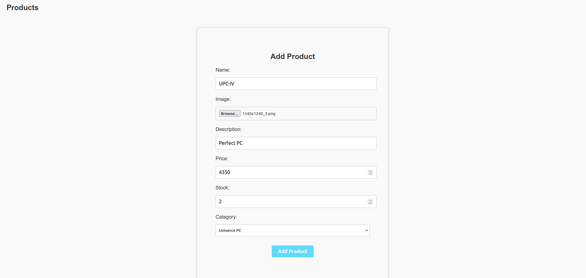
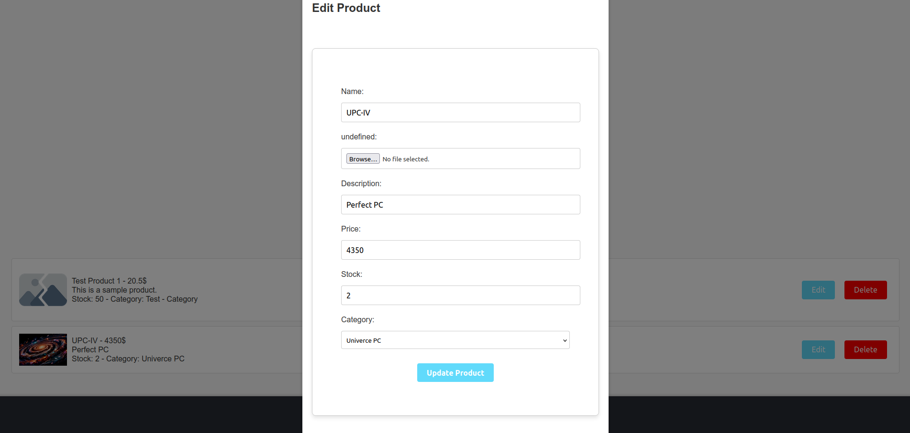

### Login Page
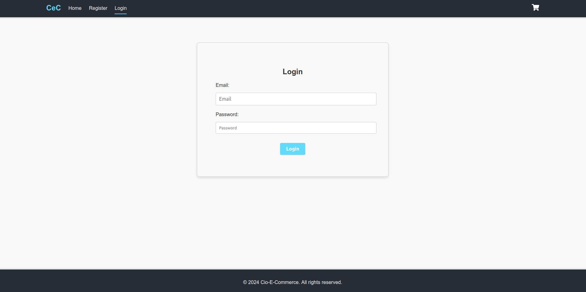

### Register Page
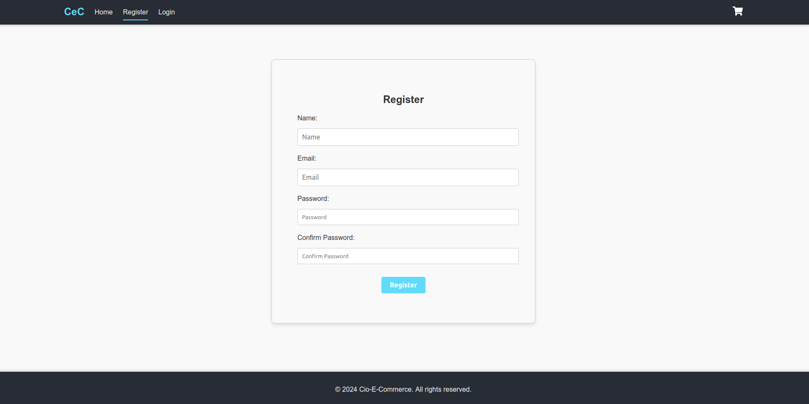

### User Dashboard

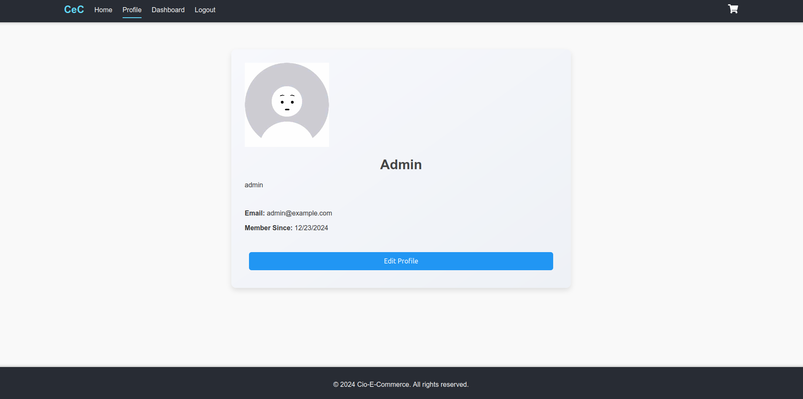

### Index Page

#### Index Page with User
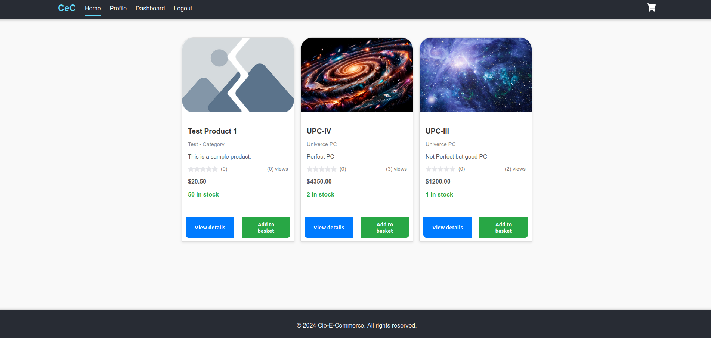
#### Index Page without User
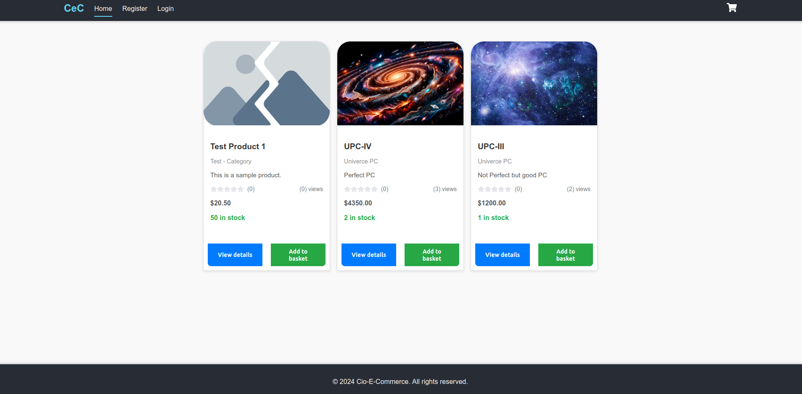

### Detail Page

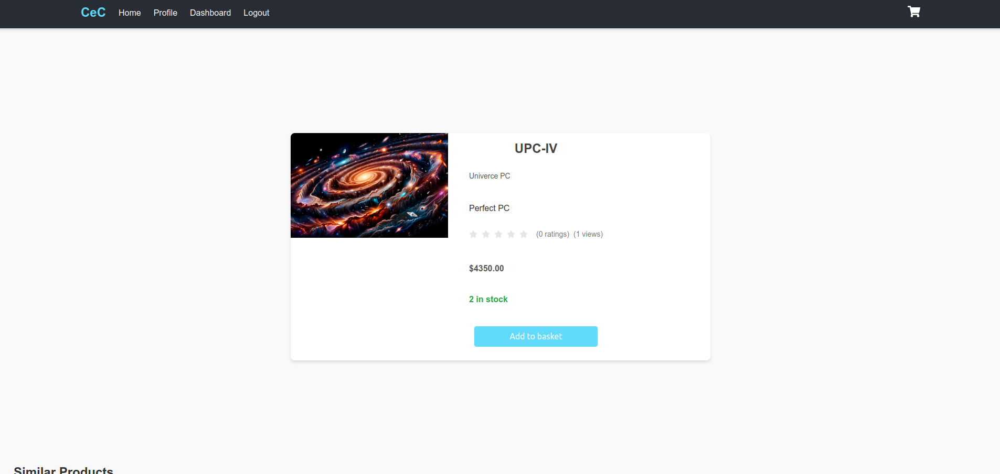

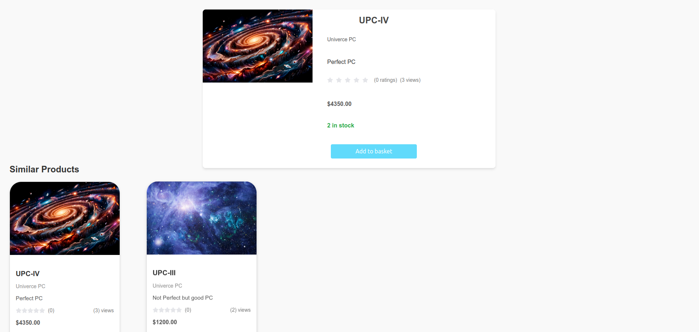

### Basket Page

#### Basket Page with User
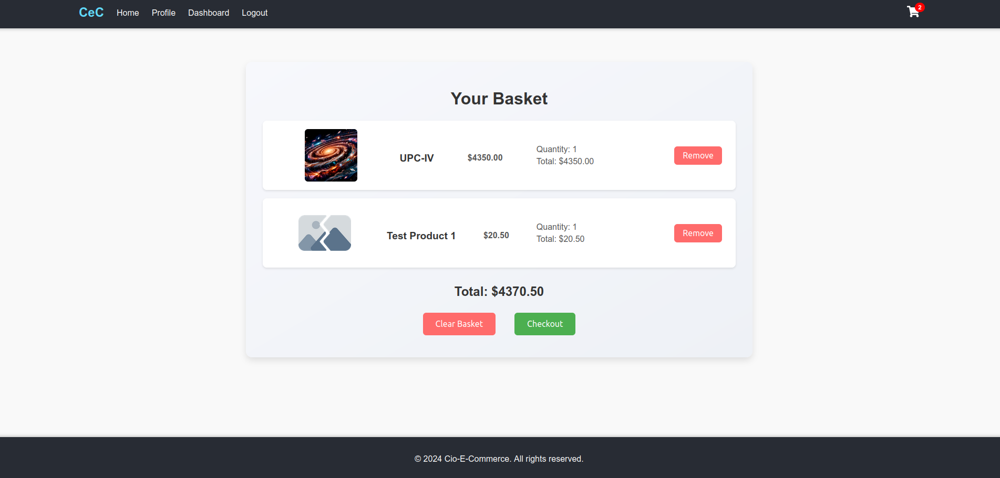
#### Basket Page without User

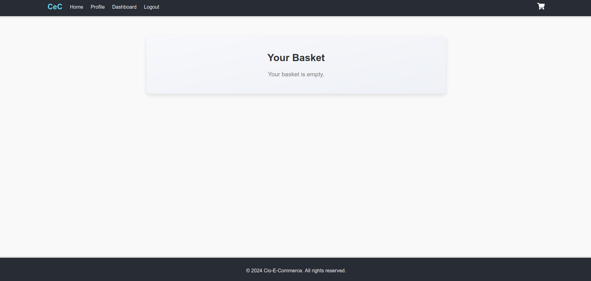


### Checkout Process

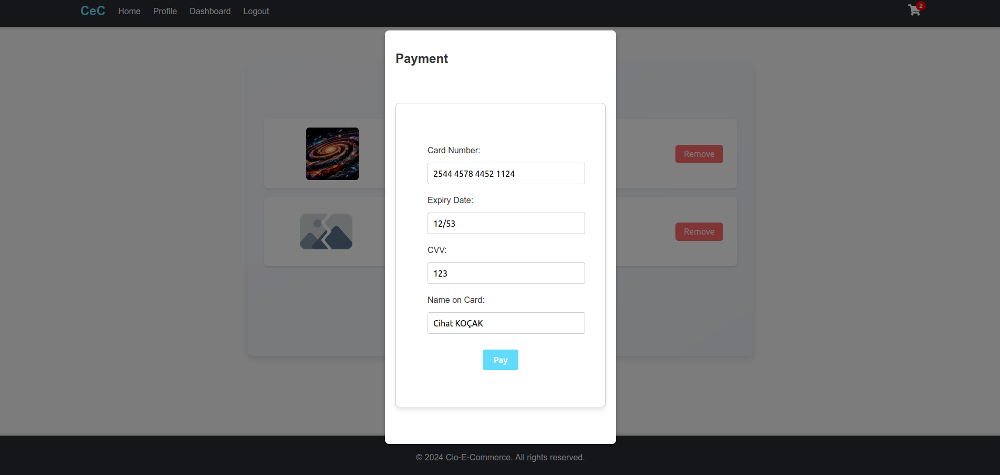

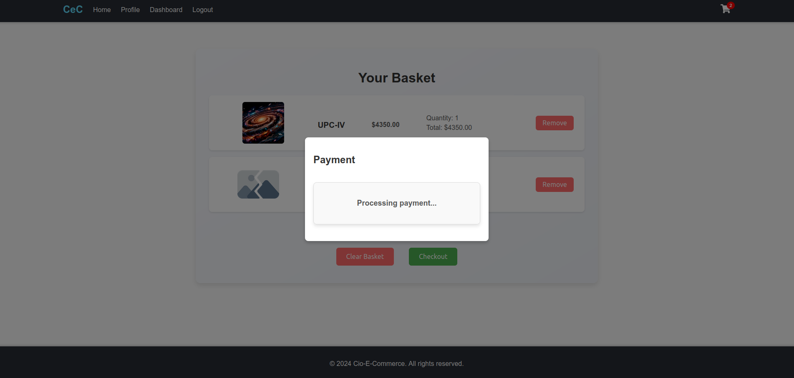

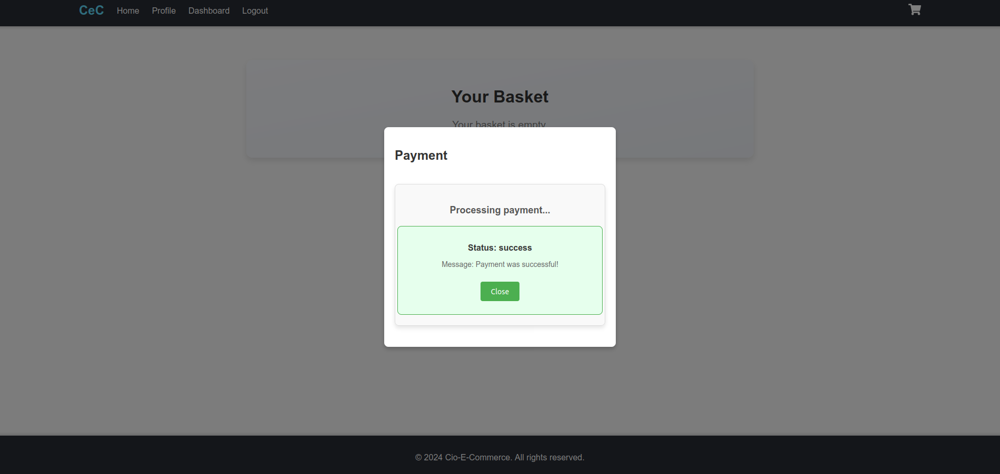

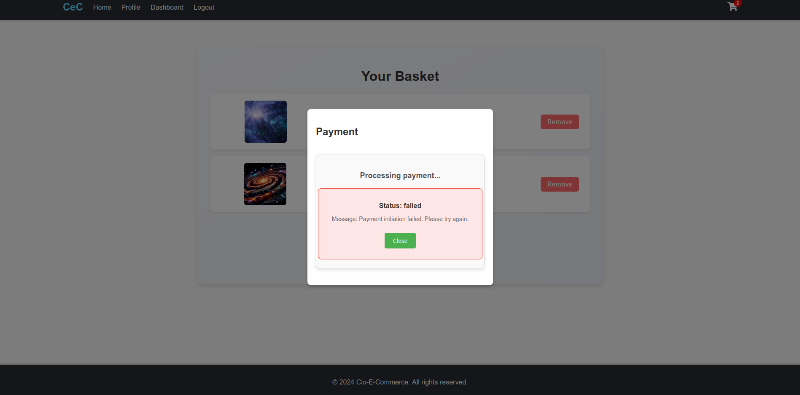

[Back to Main README](../README.en.md)