# Frontend - Screenshots

[For Turkish](README.md)

Bu bölümde, frontend servisinin dosya yapısı ve ekran görüntüleri ve kullanımı hakkında bilgiler yer almaktadır.

- [Dosya Yapısı](#dosya-yapısı)
- [Ekran Görüntüleri](#ekran-görüntüleri)

## Dosya Yapısı

```sh
frontend/
├── public/
├── src/
│   ├── assets/
│   ├── config/
│   ├── components/
│   ├── contexts/ #-AuthContext.js-BasketContext.js
│   ├── utils/
│   ├── routes/ #-AdminRoute.js-PrivateRoute.js-routeConfig.js
│   ├── pages/ # public pages - private pages
│   ├── services/ #-ApiService.js-AuthService.js-SocketService.js
│   ├── App.css
│   ├── App.js
│   ├── index.css
│   └── index.js
├── .gitignore
├── Dockerfile
├── package.json
└── README.md
```

## Ekran Görüntüleri

### Admin Dashboard

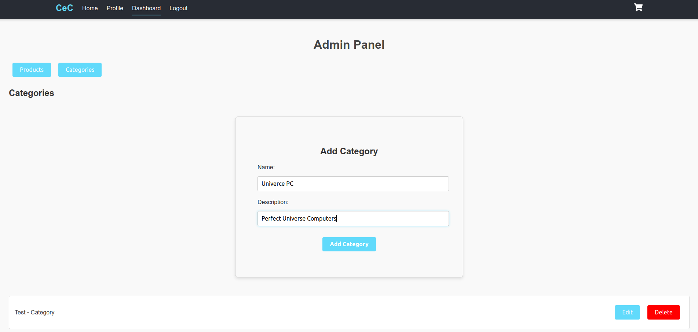
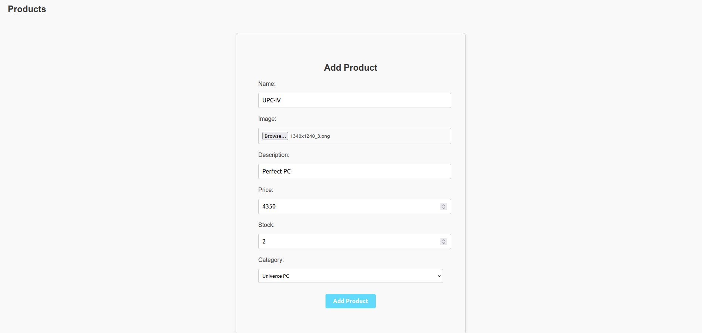
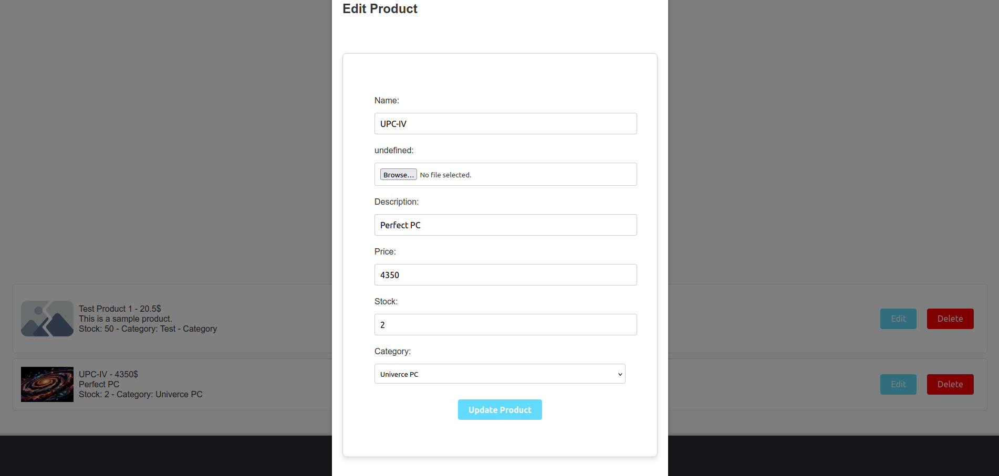

### Login Page
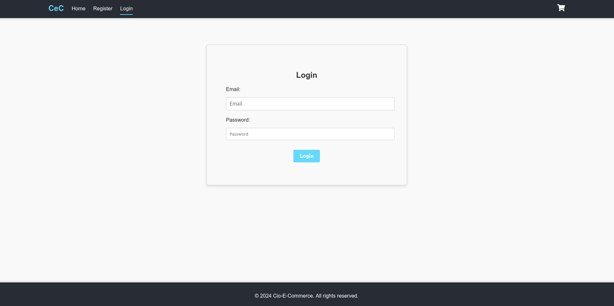

### Register Page
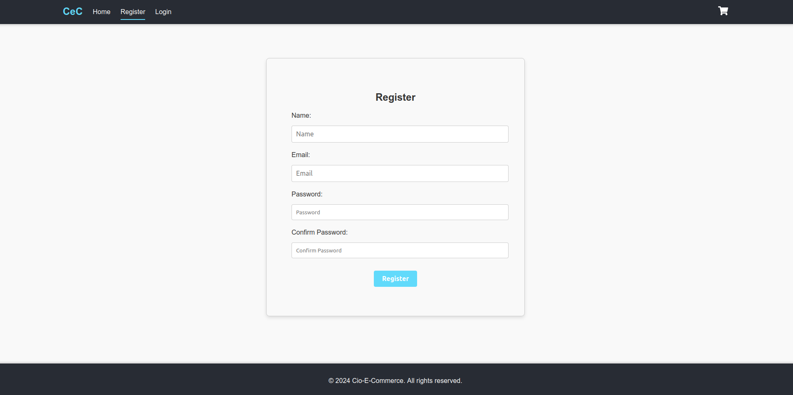

### User Dashboard

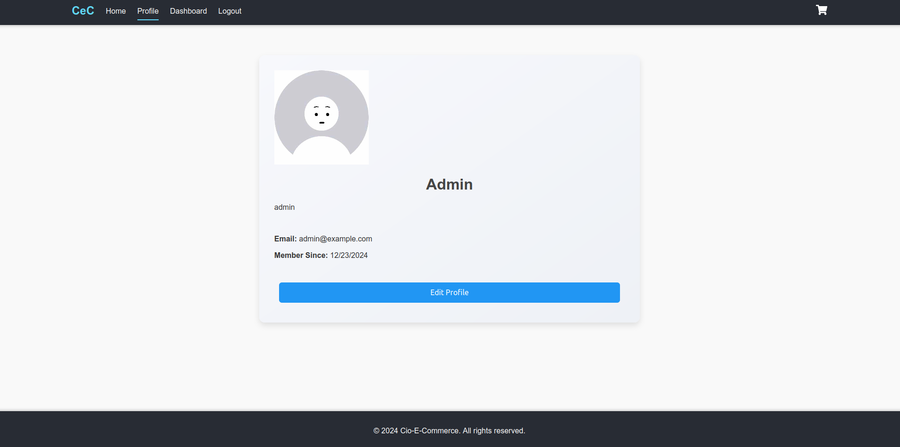

### Index Page

#### Index Page with User
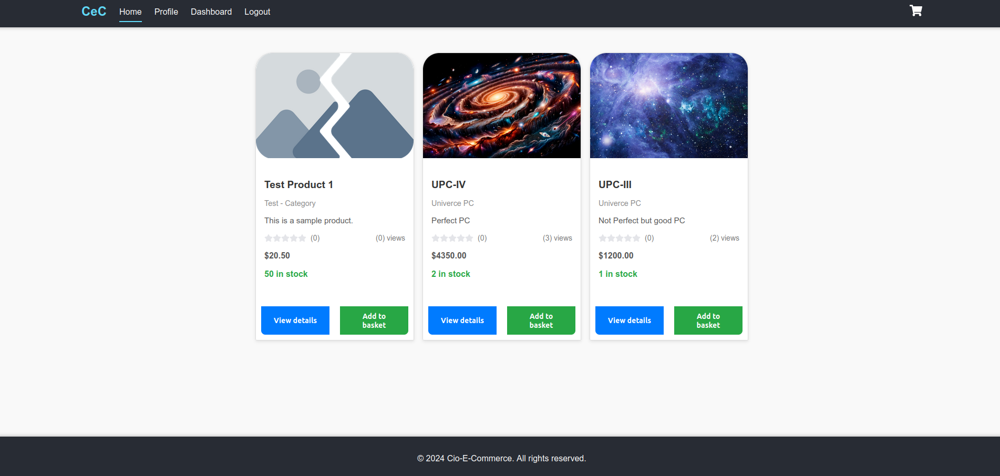
#### Index Page without User
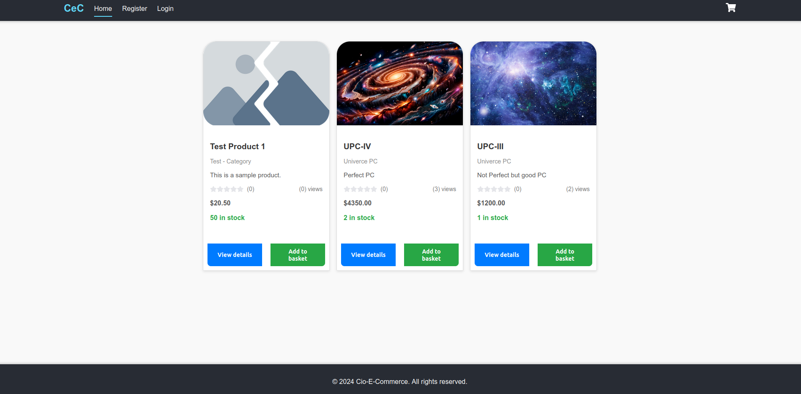

### Detail Page

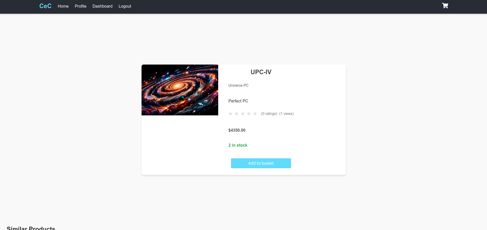

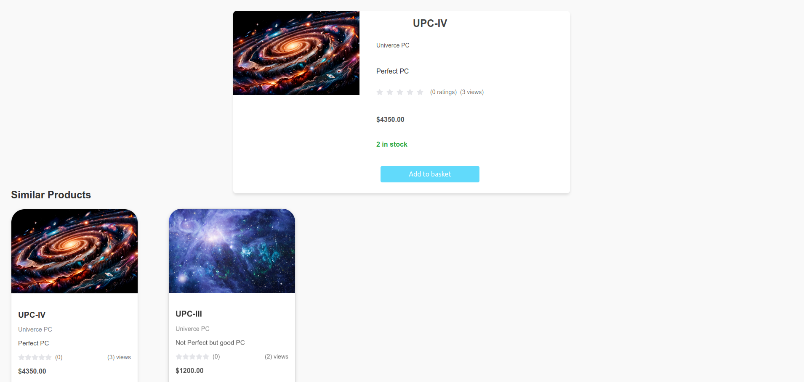

### Basket Page

#### Basket Page with User
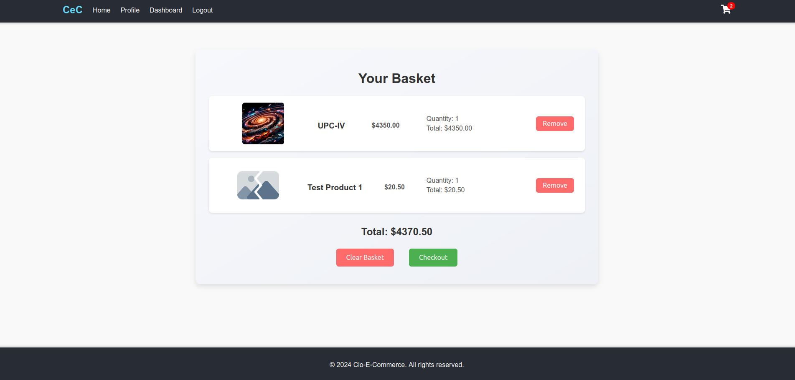
#### Basket Page without User

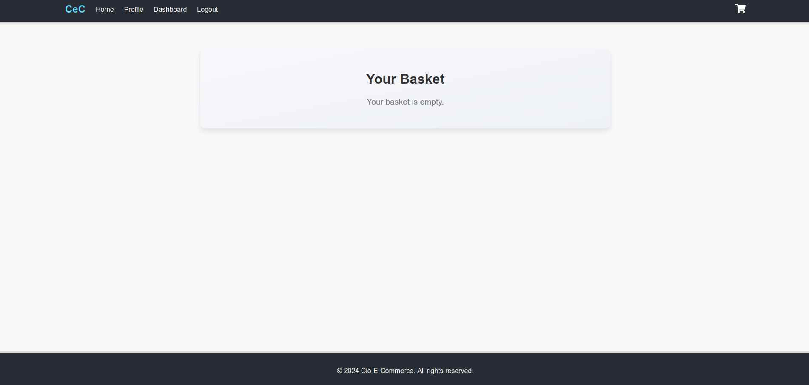


### Checkout Process


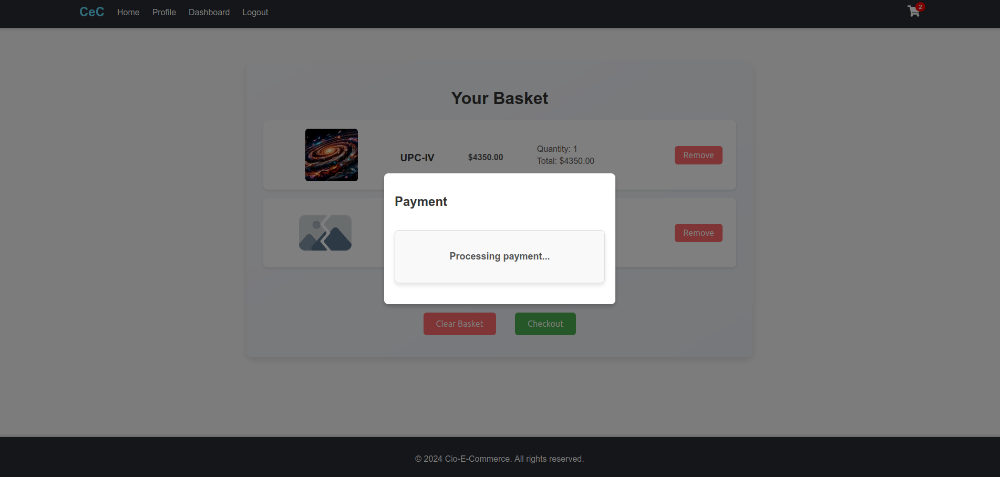

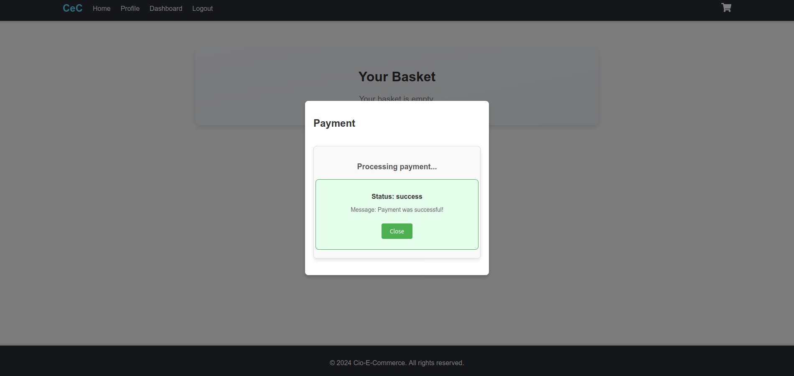

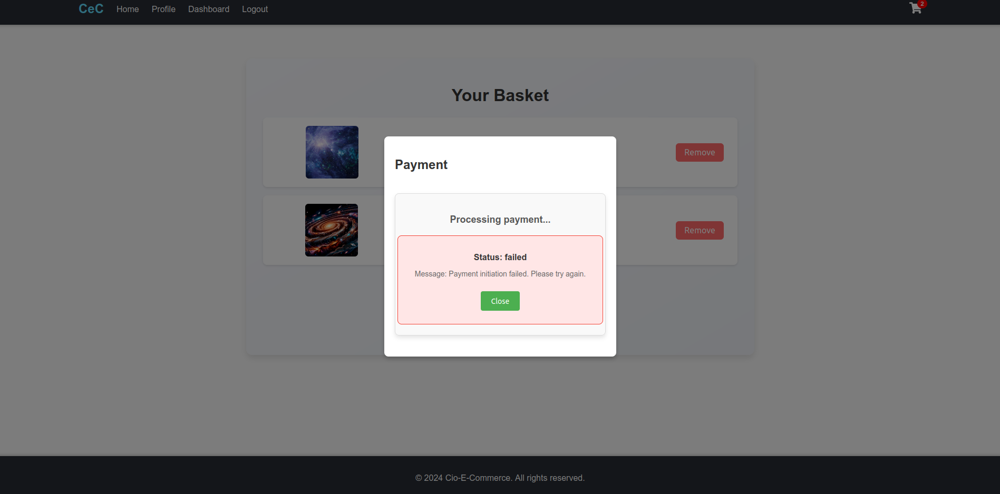

[Main README'ye dön](../README.md)